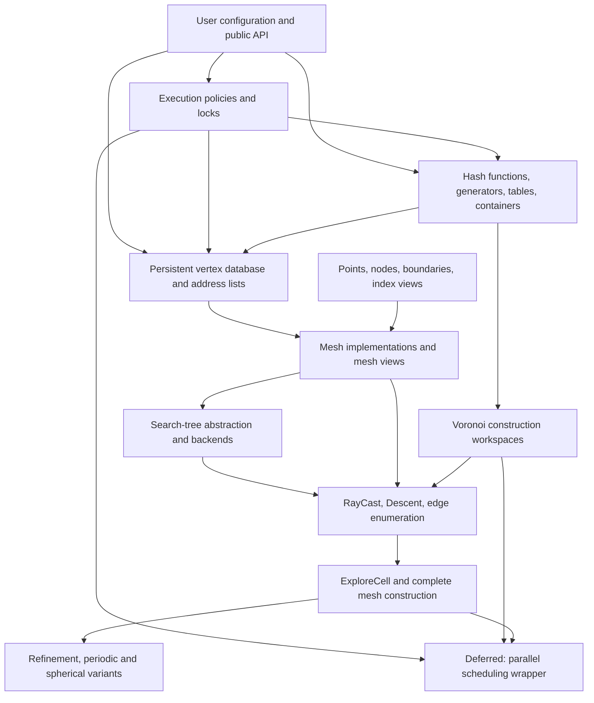

# HighVoronoiCC Architecture and Voronoi Algorithm Concept

**Status:** architectural baseline and implementation roadmap  
**Scope:** serial Voronoi mesh construction, storage, indexing, search, refinement, periodicity, and future extensibility  
**Out of scope:** volume computation, interface measures, quadrature, and general integral evaluation

---

## 1. Purpose of this document

HighVoronoiCC is intended to become a configurable C++ implementation of the local Voronoi construction algorithm described in *On the parallelized efficient computation of high dimensional Voronoi diagrams on bounded, unbounded, spherical and periodic domains*. The current implementation roadmap is deliberately serial-first. Parallel mesh construction remains a later extension and must not complicate the first complete serial design.

This document records:

1. the design philosophy behind the classes already present in the source tree;
2. the intended dependency structure between synchronization, hashing, storage, geometry, search, and the Voronoi algorithm;
3. the distinction between currently implemented infrastructure and future algorithmic components;
4. C++-oriented pseudocode for all mesh-construction parts of the concept paper;
5. invariants that future implementations must preserve.

It is an architectural reference, not a frozen API specification. Concrete names may still change, but changes should preserve the principles and separation of responsibilities described here.

All indices in this document are zero-based unless the text explicitly refers to the notation of the paper.

---

## 2. Overall objective

The core objective is an exact and local construction of Voronoi diagrams in arbitrary dimension. The algorithm must support:

- nodes in general and non-general position;
- bounded, partially unbounded, and unbounded Euclidean domains;
- planar Dirichlet, Neumann, and periodic boundaries;
- local refinement and replacement of selected mesh regions;
- structured, periodic, computed, and hybrid geometries;
- static and runtime dimensions;
- compact coordinate and index types;
- interchangeable nearest-neighbour backends;
- compile-time selection between synchronized and unsynchronized low-level data structures;
- reuse of temporary memory in all hot paths.

Parallel mesh construction is not part of the immediate implementation sequence. The serial algorithm, its geometric contracts, computed/stored composition, refinement, and periodic construction should be completed first. Existing synchronization policies remain useful infrastructure and should be preserved without allowing worker scheduling concerns to shape the near-term mesh API.

The algorithm is local: starting from one vertex of a cell, it identifies all edges emerging from known vertices and follows each previously unexplored edge to the adjacent vertex. The expected computational structure is therefore

```text
number of traversed Voronoi edges
    × cost of the required nearest-neighbour searches.
```

In the notation of the concept paper, the complexity is `O(E * NN(N))`, where `E` is the number of Voronoi edges and `NN(N)` is the cost of the selected nearest-neighbour backend.

---

## 3. Core design principles

### 3.1 Separate stable storage from public presentation

Public node indices are dense and may change after filtering, reordering, composition, or refinement. Internal indices are stable and must remain valid for the lifetime of the owning storage.

Consequences:

- persistent vertex signatures use stable internal indices;
- public numbering is provided by mappings and views;
- deleting a node must not rewrite all stored vertex signatures;
- an algorithm may use a temporary public ordering that differs from the physical storage order;
- public presentation, persistent storage, and future computed providers are separate layers.

A reordered view changes only presentation. A composite mesh may additionally route a public or top-level locator to different underlying providers. Neither operation may silently change the stable signatures already owned by a storage backend.

### 3.2 Use compile-time configuration only where it changes semantics or layout

Compile-time parameters are appropriate for:

- scalar and index types;
- static dimension;
- node access mode;
- lock type;
- hash generator and hash-table implementation;
- direct, static, or dynamic hash-table container structure;
- concrete search backend selected by a keyword/factory.

Runtime values are appropriate for:

- thread count;
- hash capacities and block sizes;
- KD-tree leaf size and build thread count;
- database block size;
- tolerances;
- whether an optional mapping cache is currently enabled.

The public configuration should remain compact. Users should not need to understand the internal lock, hash, or storage hierarchy to select a reasonable configuration.

### 3.3 No hidden allocation in hot loops

Search, ray traversal, edge construction, signature conversion, and database access are repeated extremely often. Their workspaces must therefore be reusable.

Preferred pattern:

```cpp
auto data = tree.make_backend_data();
data.reserve(expected_count);

for (...) {
    tree.write_point(data, query);
    tree.knn(data, count, skip);
    // Consume data.list without reconstructing the workspace.
}
```

The same principle applies to:

- vertex queues;
- edge counters;
- signature buffers;
- orthogonalization buffers;
- boundary candidate arrays;
- temporary points;
- any later communication buffers introduced by an outer parallel wrapper.

Convenience overloads may allocate, but every performance-critical primitive must have an overload accepting caller-owned storage.

#### Current vertex-iterator recycling

The current `AbstractMesh::VertexRange::Iterator` already follows this principle:

- `current_.position` is created once when the iterator is constructed;
- `internal_sigma_` is cleared and refilled for every record;
- `current_.sigma` is cleared and refilled after public-number conversion;
- vector capacities are retained across increments;
- `CombinedAddressList` concatenates primary and secondary address lists without creating a combined vector.

Consequently, the intended range-for or pre-increment traversal does not allocate fresh buffers for every vertex once the required capacities have been reached.

Three qualifications must remain documented:

1. a larger signature may still trigger capacity growth the first time it is encountered;
2. post-increment (`iterator++`) copies the current iterator state and may therefore copy or allocate its owning vectors. Hot paths should use range-for or pre-increment (`++iterator`);
3. every newly constructed iterator starts with new owning buffers. Repeatedly calling `empty()`, restarting a range, or constructing a second iterator for the same pass may repeat setup, reading, and initial capacity growth.

The reference returned by dereferencing the iterator refers to the iterator-owned `current_` record and is overwritten by the next increment. Callers that need to retain a vertex must copy it explicitly. Algorithms should normally construct one range/iterator per traversal and recycle that iterator until the traversal is complete.

### 3.4 Generic interfaces and hot-path interfaces are not identical

A general algorithm that supports stored, computed, and hybrid nodes should use the universal copying interface:

```cpp
nodes.copy_node(index, target);
```

A backend such as nanoflann repeatedly requests individual coordinates. It must use the direct coordinate path:

```cpp
nodes.get_data(node, coordinate);
```

Constructing a `Point`, `PointView`, `NodeHandle`, or temporary vector for every coordinate access would multiply a small inefficiency over a very large number of tree operations.

### 3.5 Backends must not leak their native indices into the mesh

The public mesh index type may be compact, for example `std::uint16_t` or `std::uint32_t`. A search backend may internally require `std::size_t` or another type.

The conversion boundary must be explicit:

```text
backend-native index -> checked conversion -> public Mesh::Index
```

No code outside the concrete backend may assume that backend indices and mesh indices are identical.

### 3.6 Provide a simple exact reference implementation

The brute-force search backend is not merely a fallback. It is the reference implementation against which optimized trees and future geometric search methods can be tested.

The same rule should be used for later components:

- first implement a clear exact version;
- establish readable tests;
- optimize behind a stable interface;
- compare every optimized implementation to the reference path.

### 3.7 Structural mutation is serial unless explicitly documented otherwise

Read-mostly low-level structures may already use configurable synchronization. Structural changes that alter mappings, child meshes, boundaries, vertex-provider routing, or search-tree topology should nevertheless be treated as serial operations in the current design.

The immediate rules are:

- one construction context mutates mesh structure;
- geometry remains stable while one cell is explored;
- persistent search structures have explicit rebuild points;
- wrappers and views must not be invalidated behind the active algorithm;
- later parallelization may introduce narrower synchronized regions without changing these serial semantics.

---

## 4. Architectural layers



Dependency direction should remain downward. In particular:

- hashing must not know about geometry;
- the database must not know how a Voronoi edge is found;
- search trees must not own algorithm queues;
- mesh classes must not contain one hard-coded nearest-neighbour implementation;
- the high-level algorithm must not depend on nanoflann-specific types.

---

## 5. Execution policies and synchronization

### 5.1 Existing lock types

The current source provides:

- `EmptyLock`: no-op synchronization with the same operational interface as the real lock;
- `BusyFIFOLock`: FIFO spin lock for very short exclusive critical sections;
- `ReadWriteLock`: FIFO read/write spin lock allowing concurrent readers or one writer;
- RAII guards and helper functions for read, write, and read-to-write transitions.

`EmptyLock` is not a runtime branch. It enables compile-time removal of synchronization overhead in strictly single-threaded configurations.

### 5.2 Existing execution policies

The current public policies are:

```cpp
SingleThread
MultiThread(thread_count)
```

They provide:

- `thread_count()`;
- the associated read/write lock type;
- a compile-time distinction between single-threaded and multi-threaded operation.

The policy should be propagated into all structures whose synchronization behavior is part of the configuration:

- database;
- queue hash tables;
- edge hash tables;
- per-node address lists;
- any later shared task queues and worker communication structures, once parallel construction is revisited.

### 5.3 Parallel mesh construction is deliberately deferred

The lock and execution-policy infrastructure is already useful for database, hash-table, and address-list configurations. It does **not** imply that the first complete Voronoi construction must be organized around workers, mailboxes, or distributed ownership.

The immediate architecture should assume one serial construction context with reusable local state. A later parallel layer may wrap the same serial operations, as in the Julia implementation, provided that it preserves:

- the same public mesh and vertex APIs;
- the same canonical internal signatures;
- the same cell-local workspaces;
- explicit synchronization only around genuinely shared mutation;
- serial execution as the deterministic reference behavior.

No worker-specific type should become mandatory in `AbstractMesh`, search backends, vertex iteration, or the core `ExploreCell` contract at this stage.

---

## 6. Hashing and temporary set structures

### 6.1 Why hashing is modular

Hashing is used in more than one role:

- persistent duplicate detection for vertex signatures;
- local duplicate detection for queued vertices;
- counting how often an edge has been encountered;
- possible later work-distribution metadata, outside the serial core.

The best hash family or collision strategy may depend on:

- signature length;
- dimension;
- machine architecture;
- expected load;
- thread count;
- whether tables are persistent or short-lived.

The algorithm must therefore depend on a hash-table contract rather than on one fixed hash function.

### 6.2 Existing hash components

The current source contains:

- FNV, XXHash, MurmurHash, and SipHash variants;
- hash generators that provide fingerprints and probe sequences;
- extensible generators combining multiple hashes;
- `QueueHashTable` and `QueueHashTable_2`;
- `EdgeHashTable`;
- direct, statically partitioned, and dynamically growing containers;
- `DataBaseParams` and `EdgeBufferParams` as compact public configuration objects.

`QueueHashTable_2` is the current default queue-table implementation. The original queue table remains selectable for comparison and benchmarking.

### 6.3 Persistent versus cell-local hash data

The same implementation family may be reused, but lifetimes are different:

- **database queue hash:** persists with the database and indexes every active stored signature;
- **cell vertex queue hash:** cleared or replaced for every processed cell;
- **cell edge buffer:** counts occurrences of edges while traversing one cell;
- **later scheduling sets:** if parallel construction is revisited, these belong to the outer scheduling layer rather than the mesh core.

These roles should not be merged into one globally locked table. Cell-local structures should remain owned by the current serial construction context.

---

## 7. Persistent vertex database

### 7.1 Current database model

`HVDataBase<Lock, DataBaseParams>` is an append-only block database. It stores records of the forms

```text
sigma_length, sigma..., vertex_position...
```

and

```text
sigma_length, sigma..., first_geometry_vector..., second_geometry_vector...
```

The second form is available for later facet-related data, but this document does not define volume or integration algorithms.

Important properties:

- storage is split into fixed-size blocks;
- positions are counted in 16-bit units;
- records may cross block boundaries;
- an atomic top counter reserves disjoint ranges for concurrent writers;
- the outer block vector grows under a write lock;
- ordinary accesses hold a shared lock against structural growth;
- addresses are one-based, so address `0` reports a duplicate insertion;
- deletion removes the signature from the queue hash and writes `sigma_length = 0` as a tombstone;
- record storage is not reclaimed immediately.

### 7.2 Why an append-only database is appropriate

The Voronoi algorithm is dominated by insertion and read access. Reclaiming arbitrary record ranges would add fragmentation, relocation, and synchronization complexity.

Stable addresses allow per-node address lists to remain valid even when records are logically deleted. Iterators can skip tombstones lazily.

### 7.3 Compact types

The node index type and vertex scalar type are configuration parameters because high-dimensional meshes can contain far more vertices than nodes.

A representative use case is:

- only about one thousand nodes, allowing a 16-bit node index;
- about one hundred thousand vertices;
- node signatures stored with compact indices;
- vertex coordinates stored as 32-bit values where sufficient;
- selected robust calculations performed temporarily in extended precision.

The database must never silently convert the configured types. It copies contiguous `Index` and `Scalar` ranges directly.

### 7.4 Future disk-backed database

A disk-backed or partially mapped database is a planned extension, not part of the current implementation.

It should preserve the existing conceptual contract:

```text
push(position, sigma) -> stable address or duplicate marker
read(address, position, sigma)
contains(sigma)
erase(address, sigma)
```

The append-only block structure is compatible with file-backed blocks, but the following questions remain open:

- block cache and eviction policy;
- crash consistency;
- address encoding across memory and disk tiers;
- synchronization of mapped block growth;
- whether the hash index is memory-resident or itself partitioned.

The in-memory database should remain the reference implementation.

---

## 8. Geometry representation

### 8.1 Points

The current point layer uses Eigen-compatible types:

- `StaticPoint<Scalar, Dim>`;
- `DynamicPoint<Scalar>`;
- read-only static and dynamic point views;
- `highvoronoi::Dynamic` as the public runtime-dimension marker.

A stored point may be exposed as a zero-copy view. A computed point must own its returned values.

### 8.2 Node access modes

The node layer defines three compile-time access modes.

#### Stored

Every node has stable contiguous storage.

```cpp
auto point = nodes[index]; // read-only zero-copy view
```

This is the preferred representation for arbitrary input point clouds and for data frequently consumed by a KD-tree.

#### Computed

A node is calculated from its index when requested.

```cpp
auto point = nodes[index]; // owning point
```

Examples include:

- Cartesian grids;
- translated copies of a periodic reference tile;
- nodes generated from a compact parametric representation.

#### Hybrid

Some nodes have stable storage and others are calculated.

```cpp
NodeHandle handle = nodes[index];
```

The handle either borrows stable storage or owns a computed point.

Examples include:

- a computed background grid with explicitly inserted irregular nodes;
- a stored refinement region inside a computed periodic exterior;
- computed ordinary nodes plus stored active boundary mirrors.

### 8.3 Universal node operations

Algorithms independent of the access mode use:

```cpp
nodes.copy_node(index, target);
nodes.get_data(index, coordinate);
```

`operator[]` is intended for convenient typed access; it must not become the only way to retrieve data.

### 8.4 Boundaries and mirror nodes

A boundary consists of oriented planes whose normals point out of the domain. The represented half-space satisfies

```text
(point - base) dot normal <= tolerance.
```

The current source supports:

- Dirichlet planes;
- Neumann planes;
- periodic pairs;
- projection, reflection, line intersection, and containment tests.

For cell-local Voronoi construction, a boundary plane is represented by a virtual mirror of the currently active cell generator. The mirror is the node for which the boundary plane becomes the ordinary Voronoi bisector between the cell generator and the mirror.

`ExtendedVoronoiNodes<BaseNodes>` stores only active-cell mirrors. `PrecomputedExtendedVoronoiNodes<BaseNodes>` precomputes every node/plane reflection.

Access-mode consequences:

```text
stored base   -> stored extended nodes
computed base -> hybrid extended nodes
hybrid base   -> hybrid extended nodes
```

Inactive mirror slots must not participate in search. Search trees therefore inspect only the sequence reported by `active_boundary_size()` and `active_boundary_index()`.

### 8.5 Public, internal, and boundary indices

The current mesh design uses:

```text
public ordinary indices: 0 ... public_node_count - 1
internal ordinary indices: stable zero-based slots
```

Boundary mirrors have a public cell-local encoding and a stable internal high-end encoding:

```text
public mirror index   = public_node_count + plane_index
internal mirror index = max(Index) - 1 - plane_index
```

`max(Index)` itself is reserved as an invalid marker.

This separation ensures that filtering ordinary nodes cannot invalidate persistent boundary signatures.

### 8.6 Vertex signatures

A vertex is represented by:

```text
sigma: sorted generating-node signature
r:     vertex coordinates
```

Persistent signatures are canonicalized in stable internal numbering.

A vertex must contain at least one ordinary node. Boundary-only signatures are invalid.

The smallest ordinary internal index is the primary storage owner. Other ordinary generators receive secondary registrations. This partitions address ownership without copying the database record.

---

## 9. Mesh architecture

### 9.1 `AbstractMesh`

`AbstractMesh` defines common behavior for compatible mesh implementations:

- public/internal signature conversion;
- boundary encoding;
- vertex storage and duplicate detection;
- primary and secondary vertex iteration;
- node and vertex filtering;
- tombstone-aware iteration;
- bridge operations used by views and composite meshes.

It deliberately separates public algorithms from private virtual primitives supplied by a concrete mesh.

### 9.2 `VoronoiMesh`

`VoronoiMesh` is the current basic concrete mesh:

- ordinary nodes are stored once in stable internal storage;
- public numbering is a dense mapping onto internal nodes;
- node deletion removes only the public mapping entry;
- primary and secondary address lists refer to a shared database;
- active boundary mirrors are stored separately by extended nodes.

It is the natural target for arbitrary point clouds whose vertices are computed once and stored.

### 9.3 `ReorderedMeshView`

`ReorderedMeshView` is a non-owning public-numbering facade.

It changes:

- the public order seen by an algorithm;
- public-to-internal and internal-to-public conversion.

It does not copy or replace:

- node coordinates;
- database records;
- stable internal indices;
- address lists;
- the boundary.

Intended uses include:

- presenting newly inserted refinement nodes first;
- testing algorithms under different public permutations;
- preserving stable storage while changing the numbering presented to an algorithm.

### 9.4 `SerialMesh`

The source snapshot contains a `SerialMesh` implementation that concatenates compatible child meshes under one global internal numbering and one shared database.

It supports:

- homogeneous or heterogeneous child mesh types sharing one exact abstract base;
- stable global internal offsets;
- optional cached public/internal conversion;
- ownership through `std::unique_ptr`;
- outer-only boundary conversion.

Important restriction: children must be appended without pre-existing active vertex records, because existing signatures would need rebasing into serial-global internal numbering.

In the supplied build snapshot, `serial_mesh.hpp` is not yet registered in the main CMake public-header list and no dedicated serial-mesh test target is present. It should therefore be treated as implemented infrastructure that still needs integration and explicit test coverage.

### 9.5 Uniform vertex API and future computed/hybrid providers

The node-access abstraction already models `Stored`, `Computed`, and `Hybrid`. On the vertex side, the important long-term requirement is not a second visibly different public API. Stored and on-demand vertices should be exposed through the same operations:

```cpp
mesh.primary_vertices(node)
mesh.secondary_vertices(node)
mesh.vertices(node)
mesh.for_each_vertex(node, function)
```

The current iterator implementation is database-backed, but its public behavior can be retained for computed and hybrid meshes. The necessary generalization belongs below the iterator interface.

#### Addresses are logical locators

A top-level `Address` must not be specified as "an address in `HVDataBase`". It is an opaque vertex locator interpreted by the mesh or composite wrapper that produced it.

A composite mesh may, for example, maintain disjoint locator ranges:

```text
[top_a, top_b) -> affine mapping into a database-backed child range
[top_b, top_c) -> affine mapping into a computed-vertex provider
[top_c, top_d) -> mapping into a stored overlay or another child mesh
```

The exact representation may be interval routing, a provider tag plus local offset, or a wrapper hierarchy. The public iterator must only ask the owning mesh to resolve the locator and fill its reusable `position` and `sigma` buffers.

This suggests that the current direct call

```cpp
mesh.database_ref().read(address, position, internal_sigma)
```

will eventually need to be hidden behind a protected primitive such as

```cpp
read_vertex(locator, position, internal_sigma)
```

or an equivalent provider interface. Database-backed meshes can forward this primitive to `HVDataBase`; computed meshes can derive the vertex from a local computed number; hybrid and serial meshes can route the locator to the appropriate child or overlay.

#### Architectural warning

Future code must not rely on any of the following assumptions outside the concrete provider:

- every vertex locator is a physical database offset;
- locator arithmetic identifies a database block;
- every vertex can be erased by tombstoning a database record;
- computed and stored locators share the same lifetime or persistence guarantees.

The common public `VertexRecord` and iteration API should remain stable. The provider-specific meaning of `address` is the part that must become abstract. This is the same general recycling principle used by the Julia mesh wrappers: composition and remapping occur around a small common mesh contract rather than by duplicating every algorithm for every mesh type.

---

## 10. Search-tree architecture

### 10.1 Common search interface

The current CRTP search base combines:

- ordinary public-node candidates supplied by a backend;
- active boundary candidates evaluated by the common base;
- checked conversion into public mesh indices;
- reusable public result storage.

Supported operations are:

```cpp
nn(data, skip)
knn(data, count, skip)
inrange(data, radius, skip)
rebuild()
```

Each concrete backend defines a public `SearchData` structure. Common fields include:

```cpp
point                 // backend-native query point
list                  // final results in Mesh::Index numbering
node_point            // reusable node buffer
public_candidates     // reusable ordinary-node candidates
boundary_candidates   // reusable active-boundary candidates
```

Backend-specific arrays remain public additions to the same structure.

### 10.2 Brute-force backend

`BruteForceSearchTree` is exact and allocation-reusing. It scans ordinary public nodes, applies the skip predicate, and merges its results with active boundary candidates.

It is the correctness reference for every optimized backend.

### 10.3 nanoflann backend

`NanoflannSearchTree` maintains a persistent KD-tree over ordinary public nodes.

Important design decisions:

- the nanoflann backend index type is independent of `Mesh::Index`;
- mesh size is checked against the backend index range;
- conversion of every result is validated;
- nanoflann reads coordinates through `nodes.get_data(node, coordinate)`;
- backend-native result arrays are retained in `SearchData` and reused;
- active boundary mirrors are handled outside the KD-tree because they change cell by cell.

The bundled local `nanoflann.hpp` is part of the source snapshot. The architecture must not silently replace it with a different external version whose interface or index semantics may differ.

### 10.4 Search factory

Built-in keywords currently include:

```cpp
KDSearch{leaf_max_size, build_thread_count}
BruteForceSearch{}
```

`SearchTreeFactory` is open for user specializations. Future backends may include:

- ball trees;
- spatial hashing;
- search specialized for periodic reference cells;
- a two-part search over structured and irregular node sets;
- direct ray-cast acceleration structures.

### 10.5 `direct_cast` and `RCCombined`

`direct_cast` is the intended C++ search-tree API for the `RCCombined` algorithm based on Lemma 2.12 of the concept paper. The current function body is only a throwing placeholder, but the intended algorithmic meaning is known.

Lemma 2.12 fuses three operations into one branch-and-bound traversal:

- nearest-neighbour candidate discovery;
- progressive in-range restriction;
- movement of the raycast center and radius whenever a closer candidate is found.

During the same search-tree traversal, candidates at the final equal distance are accumulated to recover the complete endpoint signature. This is not merely a convenience wrapper around `nn()` followed by `inrange()`; it is a specialized branch-and-bound operation whose pruning radius and query center evolve during traversal.

The architecture should therefore provide two compatible raycast paths:

1. a clear reference implementation assembled from ordinary nearest-neighbour and in-range operations;
2. `direct_cast`, implementing the fused `RCCombined` traversal in backends that support mutable branch-and-bound state.

Both paths must return the same mathematical result and use public mesh indices. The reference path validates correctness; `direct_cast` is the performance-oriented API corresponding specifically to Lemma 2.12.

The final `direct_cast` contract must carry or capture enough information to identify:

- the initial vertex or ray origin;
- the ray direction;
- the fixed edge generators or reference generator;
- skipped indices;
- the finite endpoint and all tied generators, or the unbounded-ray result;
- reusable backend-native state in `SearchData`.

---

## 11. Algorithm data model

The concept paper writes the mesh as

```text
M = (X, O, A, B, B_infinity).
```

The intended C++ correspondence is:

| Paper object | Meaning | C++ architecture |
|---|---|---|
| `X` | ordinary and temporarily active mirror nodes | `mesh.nodes()` and `mesh.extended_nodes()` |
| `O` | boundary planes and represented domain | `mesh.boundary()` |
| `A_i` | vertices primarily owned by cell `i` | primary address list and `primary_vertices(i)` |
| `B_i` | vertices visible at `i` but owned elsewhere | secondary address list and `secondary_vertices(i)` |
| `B_infinity` | unbounded rays/edges | future persistent or algorithm-result container |
| `Q` | cell-local vertex queue | future `CellWorkspace::vertex_queue` |
| `E` | cell-local edge occurrence counter | `EdgeHashTable`-based future edge buffer |
| `alpha` | active boundary-plane mask | future `CellWorkspace::active_planes` plus extended nodes |

The persistent mesh does not need to reproduce the paper's physical container layout exactly. It must reproduce the same mathematical information and traversal semantics.

---

## 12. Proposed algorithm workspaces

A future serial construction workspace should have an explicit shape similar to:

```cpp
template<class Mesh, class Tree, class EdgeBuffer>
struct CellWorkspace {
    using Index = typename Mesh::Index;
    using Scalar = typename Mesh::NodeScalar;

    typename Tree::SearchData search;

    VertexQueue vertex_queue;
    VertexQueueHash queued_vertices;
    EdgeBuffer edge_counts;

    std::vector<std::uint8_t> active_planes;
    std::vector<Index> active_mirror_indices;

    typename Mesh::Sigma sigma;
    typename Mesh::Sigma sigma_buffer;
    typename Mesh::Sigma edge_signature;
    typename Mesh::VertexPoint point;
    typename Mesh::VertexPoint direction;

    OrthogonalizationWorkspace orthogonalization;
};
```

The exact types are not fixed here. The essential requirements are:

- one allocation-reusing object per active construction context;
- no global scratch state;
- later wrappers may provide one such object per worker without changing the serial algorithm contract;
- public access to buffers needed by algorithm components;
- explicit reset operations that clear content without releasing capacity;
- backend-native search storage remains owned by the concrete `SearchData`.

---

## 13. Voronoi construction pseudocode

The pseudocode below preserves the structure of the concept paper but is adapted to zero-based C++ indexing and the current architectural separation.

### 13.1 Complete construction

```text
function BuildVoronoi(mesh, tree, workspace):
    tree.rebuild()

    for each current public cell index i:
        ExploreCell(mesh, tree, i, workspace)
```

This serial traversal is the primary construction contract. A later parallel wrapper may partition the cell loop or present reordered views, but that extension must reuse the same `ExploreCell` semantics rather than changing the mesh API.

### 13.2 Explore one cell

```text
function ExploreCell(mesh, tree, i, ws):
    ws.reset_for_cell(mesh.boundary().size())

    for each existing vertex v in mesh.vertices(i):
        for each boundary index b in v.sigma:
            if b represents a boundary mirror:
                ActivateBoundaryPlane(mesh, i, plane_of(b), ws)

    if mesh.vertices(i) is empty:
        initial = Descent(mesh, tree, i, ws)
        QueueVertex(mesh, i, initial, init = false, ws)
    else:
        for each existing vertex v in mesh.vertices(i):
            QueueVertex(mesh, i, v, init = true, ws)

    while ws.vertex_queue is not empty:
        v = ws.vertex_queue.pop_front()
        ExploreVertex(mesh, tree, i, v, ws)

        if mesh does not already contain v.sigma:
            mesh.store_vertex(v.position, v.sigma, ws.sigma_buffer)
```

Notes:

- `mesh.store_vertex` performs canonical public-to-internal conversion and duplicate detection.
- A local queue hash is still useful because repeatedly testing the persistent database would add synchronization and may not distinguish queued-but-not-yet-stored work.
- Existing vertices are queued with `init = true` so their edge counts are reconstructed even though they are already persistent.

### 13.3 Activate a boundary plane

The paper activates one mirror at a time. The current extended-node API activates a cell together with a selected list of mirror indices. The implementation can reconcile both models by maintaining the selected plane list in the workspace.

```text
function ActivateBoundaryPlane(mesh, cell, plane, ws):
    if ws.active_planes[plane]:
        return

    ws.active_planes[plane] = true
    ws.active_mirror_indices.push_back(
        mesh.extended_nodes().mirror_index(plane))

    mesh.extended_nodes().activate_cell(
        cell,
        ws.active_mirror_indices)
```

Every subsequent search sees ordinary public nodes plus exactly these active mirror nodes.

### 13.4 Queue a vertex and update edge counts

```text
function QueueVertex(mesh, cell, vertex, init, ws):
    if not init:
        if vertex already exists in mesh.vertices(cell):
            return
        if vertex signature is already present in ws.queued_vertices:
            return

    insert vertex signature into ws.queued_vertices
    ws.vertex_queue.push_back(vertex)

    edges = EnumerateEdges(mesh, cell, vertex, ws)

    for each edge in edges:
        if AlgorithmicOwner(edge.signature, current public numbering) == cell:
            ws.edge_counts.increment(edge.signature)
```

`AlgorithmicOwner` should be a function of the current algorithmic numbering, not an implicit consequence of persistent internal storage ownership.

### 13.5 Explore a vertex

```text
function ExploreVertex(mesh, tree, cell, vertex, ws):
    edges = EnumerateEdges(mesh, cell, vertex, ws)

    for each edge in edges:
        if AlgorithmicOwner(edge.signature) != cell:
            continue

        if ws.edge_counts.value(edge.signature) >= 2:
            continue

        WalkRay(
            mesh,
            tree,
            cell,
            edge.signature,
            vertex.position,
            edge.direction,
            ws)
```

An edge count of two means that both endpoint vertices have already identified the same edge. The ray need not be traversed again.

### 13.6 Enumerate edges at a vertex

```text
function EnumerateEdges(mesh, cell, vertex, ws):
    if vertex.sigma.size() == mesh.dimension() + 1:
        return EnumerateGeneralPositionEdges(mesh, cell, vertex, ws)
    else:
        return EnumerateDegenerateEdges(mesh, cell, vertex, ws)
```

#### General position

A vertex in dimension `d` has `d + 1` generators. Dropping one generator gives one edge signature of length `d`.

```text
function EnumerateGeneralPositionEdges(mesh, cell, vertex, ws):
    result.clear()

    for each generator position omitted in vertex.sigma:
        eta = vertex.sigma without the omitted generator

        if AlgorithmicOwner(eta) != cell:
            continue

        direction = unit normal to the affine span of eta
        orient direction so it points away from the vertex along the edge
        result.push_back({eta, direction})

    return result
```

The orientation test must be deterministic and must use sufficient precision.

#### Non-general position: localized convex-cone reduction

The direct enumeration of all subsets is combinatorially prohibitive. The concept paper first finds a minimal set of locally essential generators and then tests only subsets of that set.

```text
function FindEssentialConeGenerators(cell_generator, vertex_generators, ws):
    mark every generator as checked = false
    mark every generator as blocked = false

    while an unchecked generator exists:
        x = choose an unchecked generator

        face = FindFlatFaceContaining(
            cell_generator,
            x,
            all currently unblocked generators)

        if no such face exists:
            checked[x] = true
            blocked[x] = true
            continue

        if ambient dimension of face > 2:
            recursively apply the same procedure inside face
        else:
            among the face generators keep the two extreme angular generators
            block the remaining face generators

        mark all generators involved in face as checked

    return all generators with blocked == false
```

The numerical contract of `FindFlatFaceContaining` still needs a dedicated design and test specification.

After reduction:

```text
function EnumerateDegenerateEdges(mesh, cell, vertex, ws):
    Xd = all generators in vertex.sigma
    essential = FindEssentialConeGenerators(cell, Xd, ws)
    result.clear()

    for each subset S of essential with size dimension - 1:
        if S is linearly dependent relative to the cell generator:
            continue

        plane = affine plane through cell generator and S

        if generators in Xd do not all lie in one closed half-space of plane:
            continue

        eta = all generators in Xd lying in plane
        direction = oriented unit normal of plane
        canonicalize eta
        result.push_back({eta, direction})

    deduplicate result by eta
    return result
```

### 13.7 Walk along an edge

```text
function WalkRay(mesh, tree, cell, eta, start, direction, ws):
    ray_result = RayCast(mesh, tree, cell, start, direction, eta, ws)

    if ray_result is a finite vertex candidate:
        if mesh.boundary().contains(ray_result.position):
            QueueVertex(mesh, cell, ray_result, init = false, ws)
            return

        hit = first intersection of segment
              [start, ray_result.position]
              with the domain boundary

        ActivateBoundaryPlane(mesh, cell, hit.plane, ws)

        sigma = EqualNearestNeighbours(
            tree,
            hit.position,
            expected_radius from cell generator,
            ws)

        QueueVertex(mesh, cell, {sigma, hit.position}, false, ws)
        return

    boundary_hit = first valid intersection of ray
                   start + t * direction, t > 0,
                   with the domain boundary

    if boundary_hit exists:
        ActivateBoundaryPlane(mesh, cell, boundary_hit.plane, ws)

        sigma = EqualNearestNeighbours(
            tree,
            boundary_hit.position,
            expected_radius from cell generator,
            ws)

        QueueVertex(
            mesh,
            cell,
            {sigma, boundary_hit.position},
            false,
            ws)
        return

    StoreInfiniteEdge(mesh, cell, eta, start, direction, ws)
```

The first boundary intersection must satisfy all remaining half-space constraints. For a bounded convex domain this is the nearest positive valid plane intersection.

### 13.8 Ray casting

The raycast layer should expose one mathematical result with two implementation strategies. The reference strategy is assembled from `nn`/`inrange` operations. The fused strategy calls `direct_cast`, the C++ API for `RCCombined` from Lemma 2.12, and performs the evolving-center/evolving-radius branch-and-bound traversal inside the search backend.

```text
function RayCast(mesh, tree, cell, start, direction, edge_sigma, ws):
    current = start
    xi = mesh.extended_nodes().node(cell)

    candidate = nearest admissible node z satisfying
                dot(z - xi, direction) > 0
                and SkipForRayCast(z, edge_sigma, cell) == false

    if no candidate exists:
        return InfiniteRay{start, direction}

    loop:
        denominator = 2 * dot(direction, candidate - xi)

        if denominator <= geometric_tolerance:
            candidate = next admissible candidate
            if none exists:
                return InfiniteRay{start, direction}
            continue

        t = (
              squared_norm(current - candidate)
              - squared_norm(current - xi)
            ) / denominator

        if t is not positive or is not finite:
            candidate = next admissible candidate
            if none exists:
                return InfiniteRay{start, direction}
            continue

        r = current + t * direction
        radius = distance(r, xi)

        closer = nearest node strictly inside radius,
                 excluding nodes that may not replace the current candidate

        if no strictly closer node exists:
            sigma = all nodes at distance radius within the accepted tolerance
            sigma includes cell and the edge generators
            CorrectAndValidateVertex(mesh, sigma, r, ws)
            return FiniteVertex{sigma, r}

        current = r
        candidate = closer
```

Implementation notes:

- squared distances should be used until a true distance is required;
- the candidate and tie semantics must be tested on degenerate vertices;
- active mirror nodes participate exactly like ordinary nodes;
- skip predicates must not hide a generator needed to complete the endpoint signature;
- termination and monotonicity conditions should be asserted in debug builds;
- the reference raycast and `direct_cast`/`RCCombined` must be tested against one another on identical fixtures;
- `direct_cast` is a distinct fused traversal, not an alias for sequential `nn` and `inrange` calls.

### 13.9 Find an initial vertex by descent

```text
function Descent(mesh, tree, cell, ws):
    current_point = mesh.nodes().node(cell)
    current_sigma = {cell}

    for level from 0 to mesh.dimension() - 1:
        direction = random unit vector orthogonal to
                    all differences between the first generator
                    and the remaining generators in current_sigma

        result = RayCast(
            mesh, tree, cell,
            current_point,
            direction,
            current_sigma,
            ws)

        if result is infinite:
            result = RayCast(
                mesh, tree, cell,
                current_point,
                -direction,
                current_sigma,
                ws)

        require result is a finite vertex or boundary-adjusted vertex
        current_point = result.position
        current_sigma = result.sigma

    return {current_sigma, current_point}
```

Randomness is used only to avoid exceptional directions. For reproducible tests, the random direction source must be injectable or seedable.

---

## 14. Boundary and unbounded-domain behavior

The same traversal handles bounded and unbounded domains:

- if a finite adjacent vertex lies inside the domain, queue it directly;
- if the finite ray segment exits the domain first, replace the endpoint by the first boundary intersection and activate the corresponding mirror;
- if no finite adjacent vertex exists but the ray hits a boundary, create the boundary vertex there;
- if neither a finite vertex nor a boundary intersection exists, record an infinite edge.

Boundary mirrors are cell-local. A mirror of node `i` at plane `p` must never be reused as though it were the mirror of another cell without recomputation or precomputed addressing.

---

## 15. Refinement

### 15.1 Mathematical algorithm

The concept-paper refinement algorithm logically prepends new nodes, computes their cells, identifies old cells affected by the new cells, removes invalid old vertices, and completes the affected old cells.

C++-oriented pseudocode:

```text
function Refine(mesh, new_nodes, tree, ws):
    refinement_view = PresentNewNodesFirstWithoutInvalidatingStorage(
        mesh, new_nodes)

    rebuild or extend tree for the new public node set

    for each new node in refinement_view:
        ExploreCell(refinement_view, tree, new_node, ws)

    affected = empty set

    for each vertex primarily discovered from a new node:
        for each ordinary old node in vertex.sigma:
            affected.insert(old node)

    for each active old vertex:
        if every ordinary generator of the vertex is in affected:
            erase the vertex

    for each affected old node:
        ExploreCell(refinement_view, tree, old_node, ws)

    revalidate retained infinite edges
```

### 15.2 Required separation of numberings

The paper's prepend operation must not force rewriting every existing database record.

A refinement implementation should use a temporary public ordering, for example a reordered view, while persistent signatures remain in stable internal numbering.

However, this works only if the algorithm explicitly uses its public/workspace numbering for edge ownership. Persistent primary registration remains based on stable internal numbering.

`ReorderedMeshView` can provide the logical reordering, but it does not by itself create or own a new-node storage block. The complete refinement design still needs a concrete mechanism for combining new node storage with the existing mesh while retaining a shared database and valid internal conversion.

### 15.3 Search-tree update

A persistent KD-tree currently requires `rebuild()` after public-node changes. Future backends may support incremental insertion, but the algorithm must not assume that they do.

---

## 16. Fast quasi-periodic mesh generation

The concept paper considers a reference node set inside one axis-aligned tile and a multidimensional repetition count.

For interior copies, geometry can be obtained by translation and index transformation. Boundary tiles need additional treatment because the global finite boundary cuts the repeated pattern.

Only Voronoi mesh construction is considered here; copied volumes and integral data are outside this document.

### 16.1 Target architecture

A future periodic implementation should separate:

- reference-tile node and vertex data;
- a cell-copy index mapping;
- geometric translation of points;
- signature translation between reference and global numbering;
- exceptional boundary/seam regions stored explicitly.

Likely components:

```text
PeriodicComputedNodes
PeriodicIndexMapping
ComputedReferenceMesh or ReferenceVertexProvider
StoredBoundaryOverlay
HybridPeriodicMesh
PeriodicSearchTree or two-part search backend
```

### 16.2 Copy-compute pseudocode

```text
function BuildQuasiPeriodicMesh(reference_tile, repeat_counts, boundary):
    compute a sufficiently large reference neighbourhood
    identify a canonical interior copy region

    for each global tile coordinate b:
        if b is strictly interior in every repeated direction:
            expose nodes and vertices by translated computation
            translate generator signatures through periodic index mapping
        else:
            copy reusable candidates from a neighbouring completed tile
            delete candidates invalidated by the finite boundary
            run ExploreCell only where completion is required
```

### 16.3 Search implications

Building one ordinary KD-tree over a huge computed periodic set may waste both time and memory. The search factory should permit a specialized backend that searches:

1. the periodic reference structure; and
2. the comparatively small irregular or refined node overlay.

The final result is the checked merge of both candidate sets plus active boundary mirrors.

---

## 17. Voronoi diagrams on a sphere

For nodes on the unit sphere, the concept-paper construction adds the sphere center as one additional generator, computes the Euclidean Voronoi structure, keeps only edges and vertices involving the center, and normalizes the resulting vertices back onto the sphere.

```text
function BuildSphericalVoronoi(sphere_nodes):
    augmented_nodes = sphere_nodes plus origin
    center = index of origin

    build Euclidean Voronoi mesh of augmented_nodes
    skip every edge whose signature does not contain center

    for each retained vertex:
        spherical_position = normalize(vertex.position)
        remove center from the public spherical signature where appropriate
        emit spherical vertex
```

A dedicated implementation should avoid storing irrelevant Euclidean cells whenever the center-membership skip can be applied during traversal.

---

## 18. Numerical robustness and precision

### 18.1 Orthogonalization

Edge enumeration and descent repeatedly require orthogonal complements. In higher dimensions, ordinary double precision may accumulate unacceptable errors.

The source snapshot contains:

- `Float32` and `Float64` aliases with IEEE checks;
- `ExtendedFloat`, selecting a sufficiently precise `long double` when available and otherwise Boost.Multiprecision;
- Eigen vector and matrix aliases for extended precision.

This layer is not yet registered in the supplied CMake public-header list and is not exposed through the umbrella header.

Recommended policy:

- store ordinary geometry using the configured compact scalar;
- perform rare sensitive basis construction and repeated orthogonalization in `ExtendedFloat`;
- convert the final normalized direction back only after validation;
- compare the result against orthogonality and norm tolerances.

### 18.2 Vertex correction

Given a candidate signature `sigma` and approximate position `r`, all generating nodes should have the same squared distance from `r`.

```text
function CorrectAndValidateVertex(mesh, sigma, r, ws):
    compute mean squared generator distance d2
    compute relative total variation without square roots

    if variation <= accepted threshold:
        return valid

    choose a well-conditioned subset of at least dimension + 1 generators

    solve for corrected r from
        |xi - r|^2 = |x0 - r|^2
    equivalently
        |xi|^2 - |x0|^2 = 2 * dot(xi - x0, r)

    recompute variation
    accept only if the corrected candidate satisfies all geometric tests
```

The subset-selection and conditioning criteria require dedicated tests. A numerically corrected point must not be accepted if its signature is combinatorially invalid.

### 18.3 Tolerances

Tolerances should be grouped into one algorithm configuration instead of being scattered as literals. At minimum:

```text
parallel_direction_tolerance
linear_independence_tolerance
halfspace_tolerance
equal_distance_tolerance
vertex_variation_tolerance
minimum_positive_ray_parameter
```

Absolute and relative tolerances must be distinguished.

---

## 19. Public configuration goal

A future top-level construction should be simple even when the selected internals are highly configurable.

Illustrative shape:

```cpp
using DatabaseParameters = highvoronoi::DataBaseParams<
    float,
    std::uint16_t,
    highvoronoi::Murmur128HashGenerator<>,
    highvoronoi::StaticHash<8>>;

using EdgeParameters = highvoronoi::EdgeBufferParams<
    highvoronoi::Murmur128HashGenerator<>,
    highvoronoi::DynamicHash<>>;

DatabaseParameters database_parameters{
    highvoronoi::StaticHash<8>{1024}};

EdgeParameters edge_parameters{
    highvoronoi::DynamicHash<>{4, 10000, 256}};

highvoronoi::MultiThread threading{8};
highvoronoi::geometry::KDSearch search;
search.leaf_max_size = 16;
search.build_thread_count = 8;
```

The final high-level call should accept these policy objects without requiring the user to name internal lock or table specializations manually.

---

## 20. Implementation status in the supplied source snapshot

### Implemented foundations

- point types and read-only views;
- stored, computed, and hybrid node access;
- active and precomputed boundary reflections;
- planar boundaries and periodic plane pairs;
- no-op, FIFO, and read/write locks;
- single-thread and multi-thread policies;
- modular hash functions and generators;
- queue and edge hash tables;
- direct, static, and dynamic table containers;
- append-only vertex database with tombstone deletion;
- thread-policy-aware address lists;
- public/internal index views;
- `AbstractMesh`;
- concrete stored-node `VoronoiMesh`;
- `ReorderedMeshView`;
- `SerialMesh` header implementation;
- CRTP search abstraction;
- brute-force and local-nanoflann backends;
- extensible search factory;
- tests for the main implemented components.

### Partially integrated or incomplete

- `SerialMesh` is not registered in the supplied main CMake public-header list and has no dedicated test target;
- `float.hpp` is not registered or exposed through the umbrella header;
- the umbrella header currently exposes only a small subset of the intended public geometry API;
- structural mutation remains externally synchronized in several mesh paths;
- database-backed vertex resolution is still hard-coded in the base iterator path; a future opaque-locator/provider hook is not yet defined;
- `direct_cast` has its intended `RCCombined` meaning, but its backend implementation is still a throwing placeholder.

### Not yet implemented

- serial `CellWorkspace` and construction workspace types;
- exhaustive `ExploreCell` traversal;
- vertex queue integration with queue hashes;
- edge occurrence counting in the Voronoi algorithm;
- general-position edge construction;
- localized convex-cone edge enumeration;
- `RayCast` and `Descent`;
- boundary-aware `WalkRay`;
- infinite-edge storage;
- robust vertex correction integrated into construction;
- refinement;
- computed/hybrid periodic meshes;
- spherical specialization;
- parallel task scheduling and worker notification (explicitly deferred);
- disk-backed database.

---

## 21. Recommended implementation order

1. **Freeze serial algorithm contracts**  
   Define `VertexCandidate`, `EdgeCandidate`, raycast results, infinite edges, tolerances, and skip predicates without worker-specific concepts.

2. **Implement the serial cell workspace**  
   Reusable queue, queue hash, edge buffer, active-boundary state, signature buffers, search data, and orthogonalization buffers.

3. **Implement a clear reference raycast**  
   Assemble the operation from the common `nn` and `inrange` interfaces and validate it first with the brute-force backend.

4. **Implement `direct_cast` as `RCCombined`**  
   Encode Lemma 2.12 as a fused branch-and-bound traversal and compare every result against the reference raycast.

5. **Implement general-position edges and `Descent`**  
   This provides the smallest complete geometric path to an initial vertex and adjacent vertices.

6. **Implement serial `ExploreCell` and bounded-domain behavior**  
   Validate complete meshes in dimensions two and three before adding further composition layers.

7. **Add non-general-position edge enumeration**  
   Implement the localized convex-cone algorithm with focused degeneracy tests.

8. **Integrate numerical correction and extended precision**  
   Add adversarial high-dimensional tests.

9. **Implement unbounded edges and complete boundary behavior**.

10. **Implement refinement and wrapper-based remapping**  
    Reuse mesh views and composite wrappers rather than duplicating the serial algorithm.

11. **Generalize vertex resolution to opaque locators**  
    Preserve the existing vertex API while allowing database-backed, computed, and hybrid providers to resolve top-level locator ranges.

12. **Implement periodic/computed/hybrid meshes and fast quasi-periodic construction**.

13. **Implement the spherical specialization**.

14. **Add specialized search backends and optional disk storage only after profiling**.

15. **Revisit parallel mesh construction last**  
    Wrap the complete serial operations, retain serial output as the deterministic reference, and introduce synchronization only where shared mutation requires it.

---

## 22. Testing strategy

Tests should remain readable without a unit-test framework requiring cryptic macros. Each test should state:

- the geometric fixture;
- the expected combinatorial result;
- the expected coordinate result;
- why the case is architecturally relevant.

Required test groups:

### Type and compile-time contracts

- return types for stored, computed, and hybrid nodes;
- extended-node access-mode propagation;
- compact mesh index versus larger backend index;
- single-thread policy selects `EmptyLock`;
- multi-thread policy selects `ReadWriteLock`.

### Storage and indexing

- block-boundary-crossing database records;
- deletion by `sigma_length = 0`;
- public deletion without internal renumbering;
- boundary index round trips;
- reordered-view round trips;
- serial-global index conversion;
- boundary signatures after public filtering.

### Search

- brute-force and KD-tree equality for `nn`, `knn`, and `inrange`;
- active mirrors included and inactive mirrors excluded;
- skip predicates;
- backend-index overflow checks;
- no capacity loss when reusing `SearchData`.

### Voronoi algorithm

- one cell from a known initial vertex;
- `Descent` finds a valid initial vertex;
- every finite edge is traversed once;
- an edge encountered from both endpoints is skipped afterwards;
- bounded edge replaced by correct boundary vertex;
- infinite edge in an unbounded domain;
- degenerate cubic vertices;
- mixed boundary and ordinary indices;
- expected signature renumbering after views and filters;
- refinement affects exactly the necessary old cells;
- computed, stored, and hybrid providers expose identical public vertex records;
- top-level opaque locator ranges resolve to the correct underlying provider.

Deferred parallel tests should later verify that serial and parallel results have identical canonical signatures.

### Numerical robustness

- nearly dependent generators;
- repeated orthogonalization;
- corrected equal-distance residual;
- stable behavior under coordinate scaling;
- deterministic acceptance within specified tolerances.

The brute-force backend and serial construction are the primary reference paths for optimized variants and for any later parallel wrapper.

---

## 23. Architectural invariants checklist

Future code should preserve all of the following:

- [ ] Public ordinary indices are dense and zero-based.
- [ ] Persistent ordinary internal indices never change.
- [ ] `max(Index)` remains an invalid marker.
- [ ] Boundary internal indices remain disjoint from ordinary internal indices.
- [ ] Persistent vertex signatures are sorted and duplicate-free.
- [ ] A stored vertex signature contains at least one ordinary node.
- [ ] Algorithmic ownership does not depend accidentally on storage ownership.
- [ ] Backend-native search indices never escape unchecked.
- [ ] Inactive mirror nodes never enter search results.
- [ ] Computed nodes are not assumed to have stable pointers.
- [ ] Hot loops can reuse caller-owned buffers.
- [ ] A single-thread build contains no active synchronization overhead from real locks.
- [ ] A multi-thread build never inserts one canonical signature twice.
- [ ] Structural tree changes occur only at explicit rebuild/update points.
- [ ] Numerical correction validates geometry rather than only improving residuals.
- [ ] Optimized implementations are compared to exact reference implementations.
- [ ] Volume and integration code remains outside the Voronoi construction core.

---

## 24. Source map

| Area | Current principal files |
|---|---|
| Public configuration | `include/highvoronoi/parameters.hpp` |
| Locks and policies | `include/highvoronoi/detail/locks.hpp` |
| Hashes and generators | `include/highvoronoi/detail/hash_functions.hpp`, `hash_generators.hpp` |
| Hash tables and containers | `queue_hash_table*.hpp`, `edge_hash_table.hpp`, `hash_table_containers.hpp` |
| Database | `include/highvoronoi/detail/hvdatabase.hpp` |
| Address lists | `include/highvoronoi/detail/read_write_list.hpp` |
| Index views | `include/highvoronoi/detail/hvview.hpp` |
| Precision helpers | `include/highvoronoi/detail/float.hpp` |
| Points | `include/highvoronoi/geometry/point.hpp` |
| Nodes | `include/highvoronoi/geometry/voronoi_nodes.hpp` |
| Boundaries | `include/highvoronoi/geometry/boundary.hpp` |
| Mesh base | `include/highvoronoi/geometry/abstract_mesh.hpp` |
| Stored mesh | `include/highvoronoi/geometry/voronoi_mesh.hpp` |
| Reordered facade | `include/highvoronoi/geometry/mesh_view.hpp` |
| Composite mesh | `include/highvoronoi/geometry/serial_mesh.hpp` |
| Search base | `include/highvoronoi/geometry/abstract_search_tree_crtp.hpp` |
| Search backends | `brute_force_search_tree_crtp.hpp`, `nanoflann_search_tree_crtp.hpp` |
| Search selection | `include/highvoronoi/geometry/search_tree_factory_crtp.hpp` |
| Local KD-tree dependency | `include/highvoronoi/detail/nanoflann.hpp` |

---

## 25. Reference

Martin Heida, *On the parallelized efficient computation of high dimensional Voronoi diagrams on bounded, unbounded, spherical and periodic domains*, WIAS Preprint No. 3197, 2025.

Relevant algorithmic sections are:

- localized convex-cone edge enumeration: Section 2.5;
- data structures and exhaustive construction: Sections 3.1-3.3;
- RayCast and Descent: Section 3.4;
- parallelization: Section 3.6;
- refinement: Section 4;
- quasi-periodic generation: Section 5;
- spherical Voronoi diagrams: Section 6;
- numerical robustness: Section 7.
